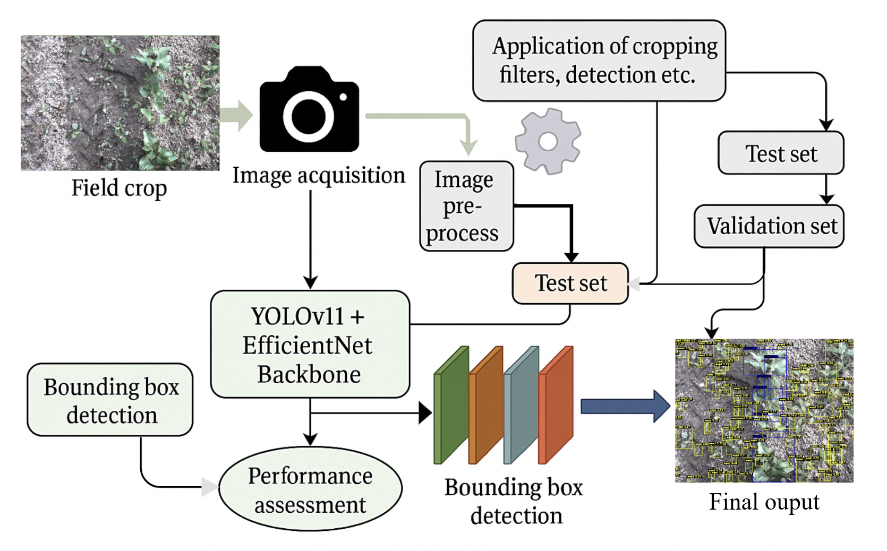
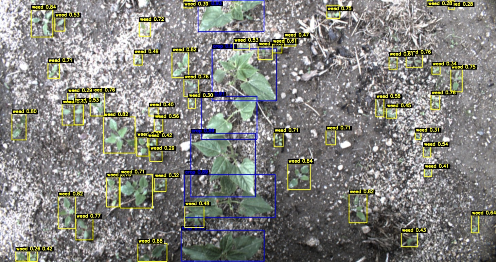

# Crop and Weed Detection using YOLOv11 + EfficientNet

This project utilizes a hybrid deep learning model that combines YOLOv11 for object detection with an EfficientNet backbone for classification. It enables real-time crop and weed detection, aiming to support precision agriculture through intelligent field monitoring.

🌿 Try the live demo here: [Agrivision Streamlit Web App](https://agrivision.streamlit.app)

---

## 🌾 Overview

Crop and weed identification in agricultural fields is a time-consuming yet essential task. This project presents a **hybrid deep learning approach** that addresses the problem through:

- **YOLOv11**: Advanced object detection architecture optimized for speed and accuracy.
- **EfficientNet Backbone**: A powerful, lightweight classification network that enhances detection precision.
- **Streamlit Web App**: Interactive interface for uploading images and viewing detection results in real time.
- **Notebook-Based Training**: Transparent and modifiable training pipeline using annotated data.

---

## 🚀 Features

- **Hybrid YOLOv11 + EfficientNet Model**: Combines detection and classification for better accuracy.
- **Real-Time Inference**: Fast object detection optimized for edge and cloud deployment.
- **Interactive Streamlit App**: Accessible web interface for field testing and demonstration.
- **End-to-End Training Pipeline**: Easily fine-tune or retrain on custom agricultural datasets.
- **Visual Performance Comparison**: Includes detection accuracy plots, mAP, and model comparisons.

---

## 🧠 System Architecture

---

## 🖥️ Output Example

### Homepage

### Upload Image

### Detection Results

---

## 📂 Project Structure

    crop-weed-detection-using-yolov11-efficientnet/
    │
    ├── Agrivision_Streamlit/
    │   ├── app/                # Streamlit frontend and model loading
    │   └── requirements.txt    # Streamlit dependencies
    │
    ├── data/                   # Dataset info or samples
    ├── models/                 # YOLOv11 and EfficientNet model weights
    ├── notebooks/              # Jupyter Notebooks for training and setup
    ├── results/                # Output plots and performance metrics
    ├── docs/                   # Diagrams and documentation
    └── requirements.txt        # Root-level requirements

---

## 🧰 Installation

1. Clone the repository:

       git clone https://github.com/tusharsachan15/crop-weed-detection-using-yolov11-efficientnet.git
       cd crop-weed-detection-using-yolov11-efficientnet

2. Install the required Python packages:

       pip install -r requirements.txt

3. Pull large files using Git LFS:

       git lfs install
       git lfs pull

---

## 📈 Usage

### Training the YOLOv11 + EfficientNet Hybrid Model

1. **Dataset Preparation**:
   - Organize your dataset in YOLO format with images and corresponding label files.
   - Use a labeled crop vs weed dataset or create a custom one using annotation tools like Roboflow or LabelImg.

2. **Train the Model**:
   Open the Jupyter notebook and run the cells step-by-step:

       notebooks/train_yolov11_efficientnet.ipynb

3. **Evaluate the Model**:
   Review the generated metrics and plots inside the notebook to validate performance (e.g., mAP, loss curves, detection outputs).

---

### Deploying the System

1. **Image Upload & Detection (Streamlit Web App)**:  
   Start the real-time image detection interface using Streamlit:

       cd Agrivision_Streamlit/app
       streamlit run app.py

2. **Model Weights**:
   The application loads model weights (`yolov11_efficientnet.pt`) automatically. You can replace this file with your own trained model for inference.

3. **Customization**:
   - Change UI styles, background images, or headers in `app.py`.
   - Modify detection confidence thresholds or classes for specific crops.

---

## 📊 Evaluation Results

Quantitative comparisons between YOLOv11-only and the hybrid model are included. Metrics like mAP and F1-score were used to benchmark performance.

---

## 🤝 Contribution Guidelines

Contributions to the project are encouraged! Whether you're interested in improving detection accuracy, adding support for new crops, or refining the web interface — your input is welcome.

To contribute:

1. Fork this repository  
2. Create a new feature branch  
3. Make your changes and test thoroughly  
4. Submit a pull request

If you're unsure where to start, feel free to open an issue or discussion first.

---

## 📬 Contact

For any questions, suggestions, or collaboration opportunities, feel free to reach out:

- **Email**: [tusharsachan2002@gmail.com](mailto:tusharsachan2002@gmail.com)
- **LinkedIn**: [Tushar Sachan](www.linkedin.com/in/tushar-sachan)

## 📚 References

- Sharma, S., & Vardhan, M. (2024). Advancing precision agriculture: Enhanced weed detection using the optimized yolov8t model. Arabian Journal for Science and Engineering, 1–18.
